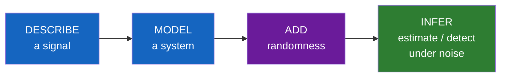
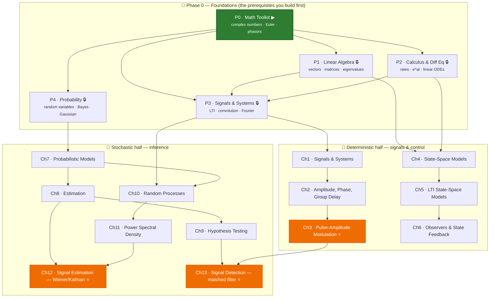
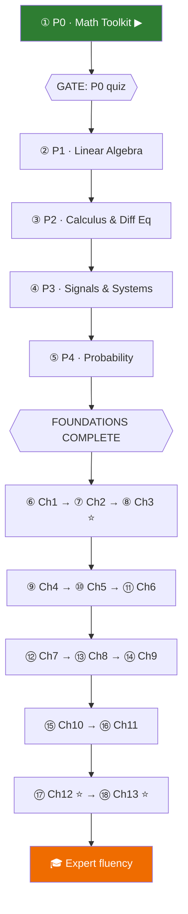

# Learning Path

A visual roadmap for [[Signals, Systems And Inference]], built for a learner starting from zero. This is the "map"; [[Curriculum]] is the detailed syllabus and [[Score Log]] holds the gate scores. **You are here → P0.**

Legend: ▶ active · 🔒 locked (unlocks when the prerequisite's quiz is passed at ≥ 80%) · ✅ passed.

---

## 1. The big picture — what the whole journey is about

Every topic serves one final goal: **pull a wanted signal out of noise.** The path climbs in four moves.

That last box — **inference** — is the math of a satellite receiver. Everything before it is the equipment you need to get there.

---

## 2. Dependency map — why the order is what it is

Arrows mean "must understand the source before the target." Foundations (P0–P4) are the prerequisites the book assumes; the 13 chapters build on them.

⭐ = the chapters closest to **satellite comms** (modulation, optimal filtering, detection) — your motivation checkpoints.

**Read the map this way:** P0 is the root everything grows from. The book then splits into two trunks — a *deterministic* one (Ch 1–6, how signals and systems behave) and a *stochastic* one (Ch 7–13, how to make decisions under noise) — which finally rejoin at detection (Ch 13).

---

## 3. The recommended single track — just follow the numbers

Dependencies allow some branching, but you don't need to think about that. Follow this order top to bottom. Each ⟶ gate is a quiz in [[Score Log]] you must pass (≥ 80%) to continue.

| # | Step | Module | Why it comes here |
|---|------|--------|-------------------|
| ① | **Foundations** | [[Complex Numbers]] · [[Euler's Formula]] · [[Sinusoids And Phasors]] (P0) | The language of every wave. **← current** |
| ② | | [[Linear Algebra Essentials]] (P1) | Vectors/eigenvalues — needed for state-space & estimation |
| ③ | | [[Calculus And Differential Equations]] (P2) | How systems evolve in time |
| ④ | | [[Signals And Systems Fundamentals]] (P3) | LTI, convolution, Fourier — the first named prerequisite |
| ⑤ | | [[Probability Fundamentals]] (P4) | Randomness — the second named prerequisite |
| ⑥–⑧ | **Book: deterministic** | Ch 1–3 | Describe signals → modulation (PAM ⭐) |
| ⑨–⑪ | | Ch 4–6 | State-space modeling & control |
| ⑫–⑭ | **Book: inference** | Ch 7–9 | Probability models → estimation → decisions |
| ⑮–⑯ | | Ch 10–11 | Random processes & their spectra |
| ⑰–⑱ | | Ch 12–13 | Optimal filtering ⭐ & detection ⭐ — the satellite-receiver payoff |

> **Pacing note.** Foundations (①–⑤) are ~60% of the total effort but unlock everything. P4 (probability) is an independent track — if you ever stall on the deterministic math, you can pull P4 forward without breaking dependencies.

---

## 4. How to use this page

- Keep this open while studying; glance at the **dependency map** whenever you wonder "why am I learning this?"
- After each module, take its quiz; I log the score in [[Score Log]] and flip the node ▶ → ✅ here and in [[Curriculum]].
- The ⭐ chapters are where this all becomes *satellite communications* — aim for them.

**Next action:** finish reading the three P0 pages, then say *"I'm ready for the P0 quiz."*
